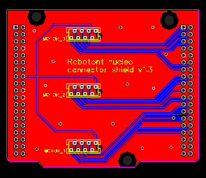
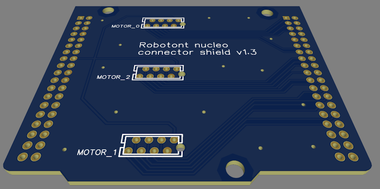

# robotont-electronics-nucleo-shield
The repository contains production files for a shield that helps to establish connection between the STM32 microcontroller and the Robotont motor driver boards.

The [production](Production/) folder contains prepared gerbers, which can be sent to a pcb manufacturer e.g. JLCPCB.

## Schematics

## Layout

The following figures visualize the pcb layout along with the 3D model of the design.

